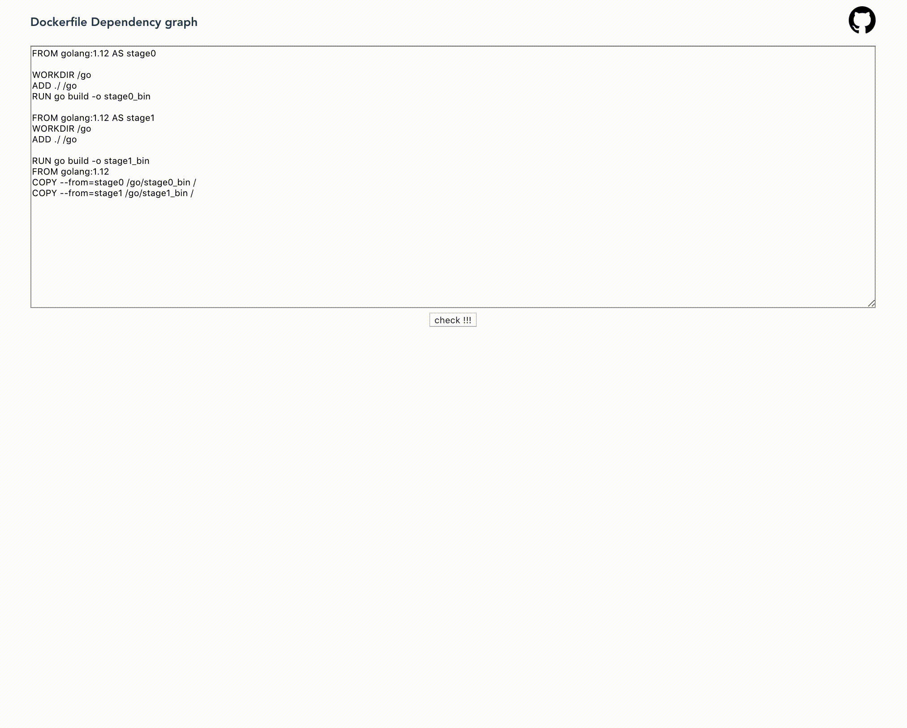
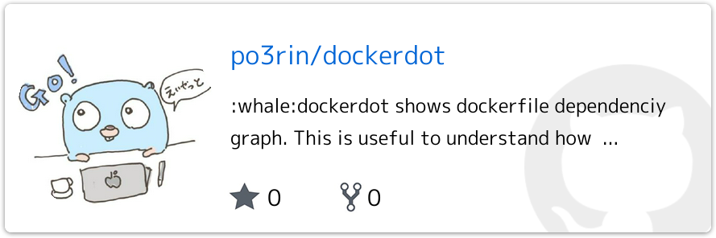
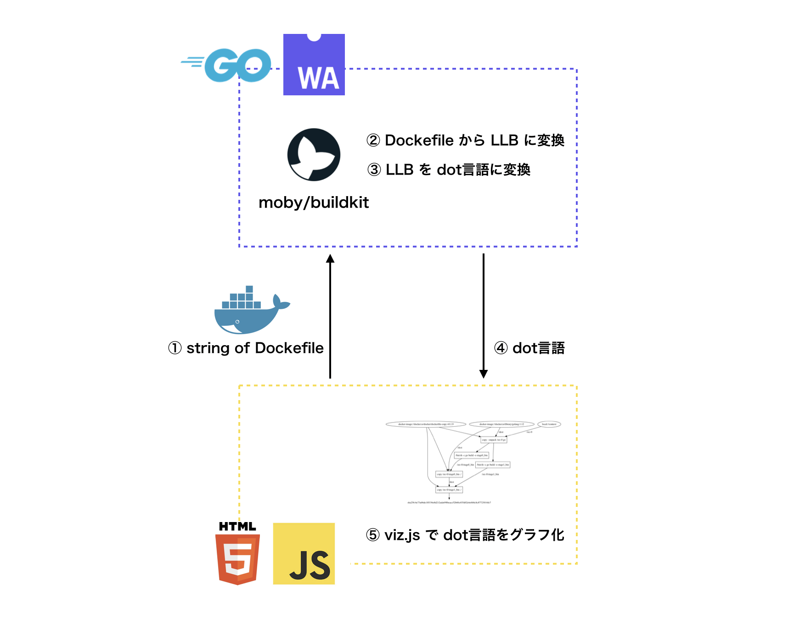
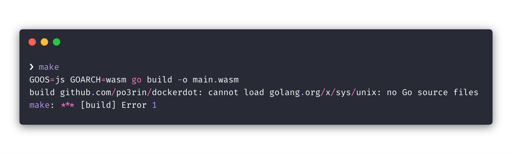

# 1日で Go + WebAssembly に入門して Dockerfile の依存グラフを図にしてくれる君を作ったので、知見とハマりポイントを共有します。

こんにちはpo3rinです。Go + WebAssembly + BuildKit で Dockerfile の依存グラフを図にしてくれる誰得サイトを作ったので紹介します。その名も「Dockerfile Dependency graph」
」！

:whale: https://po3rin.github.io/dockerdot/ :whale:
(PCブラウザだけ対応してます)

<p align="center">
    
</p>

今回はこれをどのように作ったのかとハマった点を紹介します。リポジトリはこちら！！



## どのように作ったか

全体像はこちらになります。



内部では Dockerfile から LLB(プロセスの依存関係グラフを定義するために使用されるバイナリ中間言語)を取得して、それをdot言語(データ記述言語)に変換しています。今回はその処理を Go + WebAssembly で書いています。

WebAssemblyの基本的な使い方に関してはこちらをご覧ください！Hello Worldから解説してくれます！！
https://github.com/golang/go/wiki/WebAssembly


もちろん内部ではBuildKitのパッケージを利用しています。
https://github.com/moby/buildkit

buildkitの内部でDockerfileをdot言語に変換する関数を記述しています。実装はBuildKitの非公開関数を使えるようにしただけです。
```go
// Docker2Dot convert dockerfile to llb Expressed in DOT language.
func Docker2Dot(df []byte) ([]byte, error)
```

Dockerfileのバイト列を渡せばそのDockerfileから生成した依存を記述したdot言語が所得できます。

Go + WebAssembly が Dockerfile を dot言語に変換したら後は JavaScript 側で viz.js を使ってグラフにしています。viz.jsは、dot言語で記述された構造からグラフを作成するためのパッケージです。下記のように使います。

```js
let viz = new Viz()
graph = document.getElementById("graph")
showGraph = (dot) => {
    viz.renderSVGElement(dot).then((element)=> {
        if (graph.lastChild){
            graph.removeChild(graph.lastChild)
        }
        graph.appendChild(element)
    })
}
```

これでshowGraph関数が、引数の```dot```にdot言語で記載されたLLBを渡されることで依存グラフにしてくれます。

## ハマったところ

### OSやアーキテクチャ固有の機能に依存しているパッケージは使えない。

BuildKitは内部で```http://golang.org/x/sys/unix```を使っていたので、最初、wasmのビルドに失敗しました。



Twitterでボヤいていたところ、wasmの鬼の @syuumai さんとGoの鬼の @tenntenn さんにアドバイスいただきました。wasmをビルドするときは```GOOS=js GOARCH=wasm```なのでビルドタグでビルド対象から外されてしますようです。

Twitterでの会話はこちら
https://twitter.com/po3rin/status/1139568570239635456

よって今回は moby/buildkit の中からOSやアーキテクチャ固有の機能に依存している処理を使わないようにmoby/buildkitのコードから必要部分だけをmirrorして使っています。

### 内部でゴールーチンを読んでいるパッケージの処理をコールバック関数で呼ぶとデッドロックが起きる

こちらのコードラボで注釈されている問題に見事ハマりました。

> コールバック関数は1つのゴールーチンの中で1つずつ処理されます。そのため、コールバック関数の中で、コールバック関数によって結果を受け取るような処理があるとデッドロックが起きてしまいます。

```moby/buildkit``` では sync.ErrGroup でバリバリ並行処理が行われていたのでデッドロックが起きていました。そのため別のゴールーチンを起動して呼び出す必要がありました。

```go
func registerCallbacks() {
	var cb js.Func
	document := js.Global().Get("document")
	element := document.Call("getElementById", "textarea")

	cb = js.FuncOf(func(this js.Value, args []js.Value) interface{} {
		text := element.Get("value").String()
		dockerfile := []byte(text)

		// https://github.com/golang/go/issues/26382
		// should wrap func with gorutine.
		go func() {
			dot, err := docker2dot.Docker2Dot(dockerfile)
			if err != nil {
				fmt.Println(err)
			}
			showGraph := js.Global().Get("showGraph")
			showGraph.Invoke(string(dot))
		}()
		return nil
    })

	js.Global().Get("document").Call("getElementById", "button").Call("addEventListener", "click", cb)
}
```

## 初めて触った所感

最初はハマってましたが、慣れてきたらJavaScriptからGoの処理を呼ぶ簡単さに感動を覚えます。そしてGoで書いたのにデプロイが楽チンというのも気持ちよかったです。

## 今回の開発で参考にした記事

だいたいここ読んでおけば良い

go wiki: WebAssembly
https://github.com/golang/go/wiki/WebAssembly
(公式による解説)

Go 1.11: WebAssembly for the gophers
https://medium.zenika.com/go-1-11-webassembly-for-the-gophers-ae4bb8b1ee03
(syscall/jsの解説が充実している)

GoでWebAssemblyに触れよう
https://golangtokyo.github.io/codelab/go-webassembly/?index=codelab#0
(ハンズオンとして最適)
