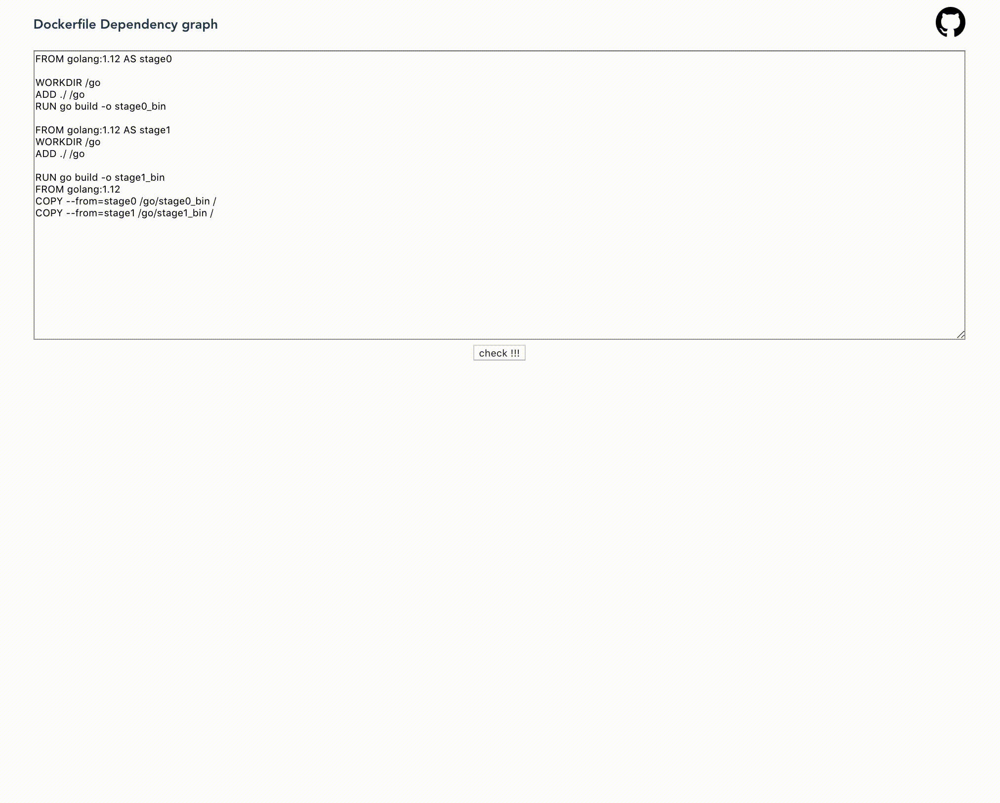

# dockerdot

---

dockerdot shows dockerfile dependenciy graph. This is useful to understand how build dockerfile.
This uses Go WebAssembly + BuildKit package.

:whale: https://po3rin.github.io/dockerdot/ :whale:

    

## Go + WebAssembly
https://github.com/golang/go/wiki/WebAssembly

## DOT language
https://medium.com/@dinis.cruz/dot-language-graph-based-diagrams-c3baf4c0decc

## Warn

dockerbot/dockerfile2llb package is almost mirror from moby/buildkit. but sygnal package is not used.
